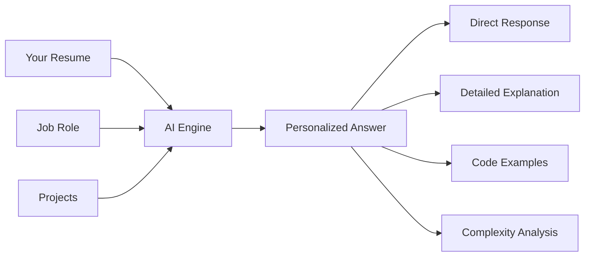
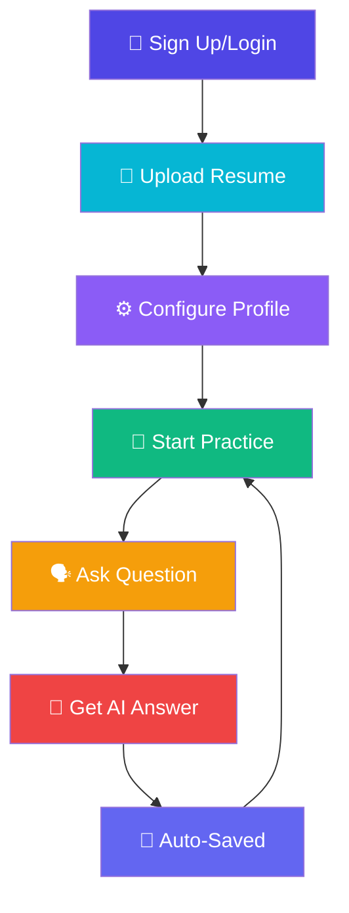
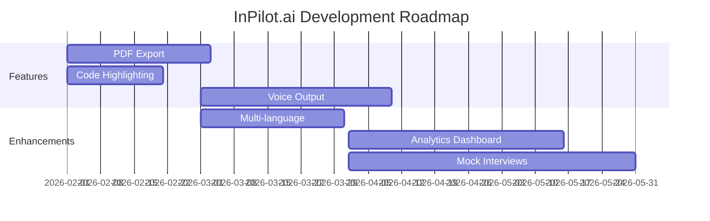

<div align="center">

# 🎤 InPilot.ai 🤖


<p>
   
   
   
   
</p>

<p>
   
   
   
   
</p>

<h3>✨ The Future of AI-Powered Interview Practice ✨</h3>

<p align="center">
   <b>🎯 Voice-Based • 🤖 AI-Driven • 📄 Resume-Personalized • 💾 Cloud-Synced</b>
</p>


</div>

---

## 🌟 Highlights

<table>
   <tr>
      <td align="center" width="33%">
         
         <h3>🎤 Voice Interview Practice</h3>
         <p>Real-time voice recording with automatic silence detection and browser-based speech-to-text</p>
      </td>
      <td align="center" width="33%">
         
         <h3>🤖 AI-Powered Answers</h3>
         <p>Personalized responses based on YOUR resume, projects, and target role</p>
      </td>
      <td align="center" width="33%">
         
         <h3>🔒 Secure & Modern</h3>
         <p>Clerk authentication, Supabase storage, beautiful UI with animations</p>
      </td>
   </tr>
</table>

<div align="center">

</div>

---

## 🚀 Key Features

<details open>
<summary><h3>📄 Smart Resume Processing</h3></summary>

<table>
<tr>
<td width="50%">

#### 📤 Multiple Upload Options
- 📑 **PDF** - Accurate extraction with pdf2json
- 📝 **DOCX/DOC** - Word document support
- 📄 **TXT** - Direct text files
- 📋 **Paste** - Quick copy-paste option

</td>
<td width="50%">

#### ⚡ Advanced Features
- 🔄 **Auto-Save** - Instant database sync
- 💾 **Permanent Storage** - Never lose your data
- 🌐 **Cross-Device** - Access anywhere
- 🎨 **Loading Animations** - Beautiful feedback

</td>
</tr>
</table>

</details>

<details open>
<summary><h3>🤖 AI Personalization Engine</h3></summary>



**The AI responds AS YOU**, using:
- ✅ Your actual name and experience
- ✅ Your specific projects and implementations
- ✅ Your target job role requirements
- ✅ Your custom instructions and preferences

</details>

<details open>
<summary><h3>🎙️ Voice Recording Features</h3></summary>

| Feature | Description |
|---------|-------------|
| 🎤 **Real-Time Recording** | Browser-based voice capture |
| 🔇 **Auto-Stop** | Stops after 2s of silence |
| 📝 **Live Transcript** | See your words in real-time |
| 🎨 **Visual Feedback** | Animated recording indicator |
| 🌐 **Web Speech API** | No external dependencies |

</details>

<details open>
<summary><h3>💾 Data Persistence</h3></summary>

<table>
<tr>
<td align="center" width="25%">

<br><b>Supabase DB</b>
<br>Primary Storage
</td>
<td align="center" width="25%">

<br><b>Auto-Sync</b>
<br>Real-time Updates
</td>
<td align="center" width="25%">

<br><b>localStorage</b>
<br>Backup Storage
</td>
<td align="center" width="25%">

<br><b>Cross-Device</b>
<br>Access Anywhere
</td>
</tr>
</table>

</details>

---

## 🎯 What Makes InPilot.ai Special?

<div align="center">

| 🌟 Feature | 📝 Description | 🎁 Benefit |
|:----------:|:---------------|:-----------|
| **Resume-Driven** | AI uses YOUR actual resume | Authentic, personalized responses |
| **Project Context** | References YOUR implementations | Deep technical answers |
| **Role-Specific** | Tailored to YOUR target job | Relevant, focused practice |
| **Permanent Storage** | Cloud-synced database | Never lose your progress |
| **Voice-First** | Hands-free practice | Natural interview simulation |
| **Instant Feedback** | Real-time AI responses | Efficient learning |

</div>

---

## 🛠️ Tech Stack

<div align="center">

<table>
<tr>
<td align="center" width="20%">

<br><b>Next.js 14</b>
</td>
<td align="center" width="20%">

<br><b>React</b>
</td>
<td align="center" width="20%">

<br><b>TypeScript</b>
</td>
<td align="center" width="20%">

<br><b>Tailwind CSS</b>
</td>
<td align="center" width="20%">

<br><b>Supabase</b>
</td>
</tr>
</table>

**Additional Technologies:**
- 🔐 **Clerk** - Authentication & User Management
- 🤖 **OpenAI GPT** - AI Answer Generation
- 🎨 **Shadcn UI** - Beautiful Components
- ✨ **Framer Motion** - Smooth Animations
- 📄 **pdf2json** - PDF Text Extraction
- 📝 **mammoth** - DOCX Processing

</div>

---

## 📦 Quick Start

<details>
<summary><b>🚀 Installation & Setup (Click to expand)</b></summary>

### 1️⃣ Clone & Install

```bash
git clone https://github.com/yourusername/inpilot.git
cd inpilot
npm install
```

### 2️⃣ Environment Variables

Create `.env.local`:

```env
# 🔐 Clerk Authentication
NEXT_PUBLIC_CLERK_PUBLISHABLE_KEY=pk_test_...
CLERK_SECRET_KEY=sk_test_...

# 💾 Supabase
NEXT_PUBLIC_SUPABASE_URL=https://xxx.supabase.co
NEXT_PUBLIC_SUPABASE_ANON_KEY=eyJhbGc...

# 🤖 OpenAI
OPENAI_API_KEY=sk-...
OPENAI_BASE_URL=https://api.openai.com/v1
```

### 3️⃣ Database Setup

Run these SQL migrations in Supabase SQL Editor:

```sql
-- 📊 Resumes Table
CREATE TABLE IF NOT EXISTS user_resumes (
  id UUID DEFAULT gen_random_uuid() PRIMARY KEY,
  user_id TEXT NOT NULL UNIQUE,
  resume_content TEXT NOT NULL,
  file_name TEXT NOT NULL,
  job_role TEXT,
  custom_instructions TEXT,
  created_at TIMESTAMPTZ DEFAULT NOW(),
  updated_at TIMESTAMPTZ DEFAULT NOW()
);

-- 📁 Projects Table
CREATE TABLE IF NOT EXISTS user_projects (
  id UUID DEFAULT gen_random_uuid() PRIMARY KEY,
  user_id TEXT NOT NULL,
  name TEXT NOT NULL,
  content TEXT NOT NULL,
  created_at TIMESTAMPTZ DEFAULT NOW(),
  updated_at TIMESTAMPTZ DEFAULT NOW()
);

-- Enable RLS
ALTER TABLE user_resumes ENABLE ROW LEVEL SECURITY;
ALTER TABLE user_projects ENABLE ROW LEVEL SECURITY;

-- Create policies
CREATE POLICY "Enable all access" ON user_resumes FOR ALL USING (true) WITH CHECK (true);
CREATE POLICY "Enable all access" ON user_projects FOR ALL USING (true) WITH CHECK (true);
```

### 4️⃣ Run Development Server

```bash
npm run dev
```

🎉 Open [http://localhost:3000](http://localhost:3000)

</details>

---

## 🎮 How to Use

<div align="center">



</div>

### 📋 Step-by-Step Guide

<table>
<tr>
<td width="33%" align="center">

#### 1️⃣ Setup Profile


- Upload your resume
- Set target job role
- Add custom instructions
- Include project docs

</td>
<td width="33%" align="center">

#### 2️⃣ Practice Interview


- Click microphone
- Ask your question
- Auto-stops on silence
- View AI answer

</td>
<td width="33%" align="center">

#### 3️⃣ Review & Learn


- Read personalized answer
- Review code examples
- Check complexity
- Save to history

</td>
</tr>
</table>

---

## 🎨 UI Showcase

<div align="center">

### ✨ Beautiful Animations & Effects

| Effect | Description |
|:------:|:------------|
| 🔄 **Pulse Glow** | Dynamic pulsing around active elements |
| 💬 **Live Transcript** | Real-time text with fade-in effects |
| 🎯 **Button Animations** | Hover and click interactions |
| 📊 **Progress Bars** | Smooth loading indicators |
| 🌈 **Gradients** | Color transitions across UI |
| 🟢 **Status Feedback** | Visual recording/processing states |


</div>

---

## 📊 Project Structure

```
inpilot/
├── 📱 app/
│   ├── 🔌 api/
│   │   ├── extract-text/      # PDF/DOCX extraction
│   │   ├── generate-answer/   # AI generation
│   │   └── reviews/           # User reviews
│   ├── 🏠 dashboard/          # Main dashboard
│   ├── 🔐 sign-in/           # Authentication
│   └── 📄 page.tsx           # Landing page
├── 🧩 components/
│   ├── 🎤 VoiceRecorder.tsx   # Voice recording
│   ├── 📄 ResumeUploader.tsx  # Resume upload
│   └── 💬 AnswerDisplay.tsx   # Answer display
├── 📚 lib/
│   ├── 🤖 ai-service.ts       # OpenAI integration
│   └── 💾 supabase.ts         # Database client
└── 🗄️ supabase/
    └── 📊 migrations/         # SQL schemas
```

---

## 🔧 Customization

<details>
<summary><b>⚙️ Configuration Options</b></summary>

### 🤖 Change AI Model

```typescript
// lib/ai-service.ts
model: 'llama-3.1-8b-instant', // or 'gpt-4', 'gpt-3.5-turbo'
```

### ⏱️ Adjust Silence Detection

```typescript
// components/VoiceRecorder.tsx
setTimeout(() => {
  // Stop recording
}, 2000) // milliseconds
```

### 🎨 Modify Theme Colors

```typescript
// tailwind.config.ts
colors: {
  primary: '#6366f1', // Customize
}
```

</details>

---

## 🐛 Troubleshooting

<details>
<summary><b>❓ Common Issues & Solutions</b></summary>

### 🎤 Microphone Not Working
- ✅ Check browser permissions
- ✅ Use HTTPS (required for Web Speech API)
- ✅ Try Chrome/Edge for best support

### 📄 PDF Upload Issues
- ✅ Ensure PDF is not password-protected
- ✅ Check file size (keep reasonable)
- ✅ Try converting to TXT if issues persist

### 💾 Database Connection
- ✅ Verify Supabase credentials in `.env.local`
- ✅ Run all SQL migrations
- ✅ Check Supabase project status

### 🤖 AI Not Responding
- ✅ Verify OpenAI API key
- ✅ Check API credits
- ✅ Review console for errors

</details>

---

## 🌟 Recent Updates

<div align="center">

| 🗓️ Date | ✨ Feature | 📝 Description |
|:-------:|:-----------|:---------------|
| **Jan 2026** | 📄 Resume Upload | PDF/DOCX/TXT support with accurate extraction |
| **Jan 2026** | 💾 Permanent Storage | Supabase database integration |
| **Jan 2026** | 🤖 AI Personalization | Resume-based, role-specific answers |
| **Jan 2026** | 📁 Project Context | Multiple project documentation support |
| **Jan 2026** | 🎨 UI Enhancements | Loading animations and visual feedback |

</div>

---

## 🚀 Future Roadmap

<div align="center">



</div>

- [ ] 📑 Export answers as PDF
- [ ] 🎨 Code syntax highlighting
- [ ] 🌍 Multi-language support
- [ ] 🔊 Text-to-speech for answers
- [ ] 📊 Performance analytics
- [ ] 🎯 Mock interview scheduling
- [ ] 📹 Video recording support
- [ ] 📝 Resume builder/editor

---

## 📜 License

<div align="center">

**Copyright © 2026 Lagishetti Vignesh**


All rights reserved. Unauthorized use prohibited.

For licensing inquiries: **lvigneshbunty789@gmail.com**

</div>

---

## 🤝 Contributing

<div align="center">

Contributions are welcome! 


</div>

---

## 📞 Support & Contact

<div align="center">

<table>
<tr>
<td align="center">

<br><b>Email</b>
<br>lvigneshbunty789@gmail.com
</td>
<td align="center">

<br><b>GitHub</b>
<br>Open an Issue
</td>
<td align="center">

<br><b>Website</b>
<br>vigneshlagishetti.me
</td>
</tr>
</table>

</div>

---

<div align="center">


### 💫 Built with ❤️ by **Lagishetti Vignesh**


</div>
